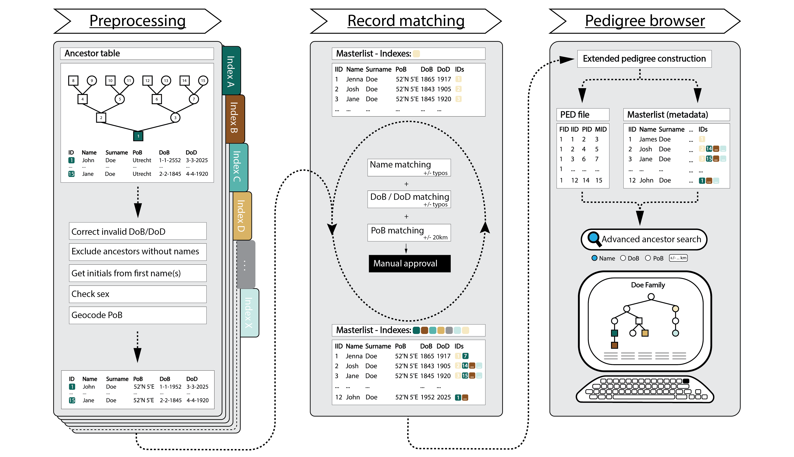
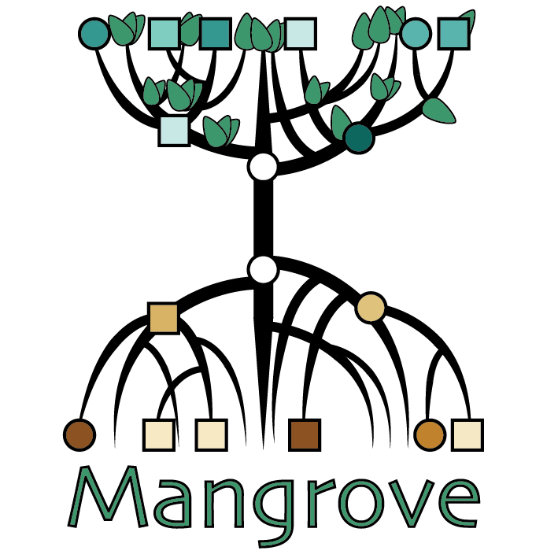

### Introduction
Mangrove is a software toolkit for reconstructing extended pedigrees (superpedigrees) from archive data. Key features include automated detection of shared ancestors and an interactive databrowser to view the constructed superpedigrees and query the database of ancestors.
If Mangrove is useful for your work, please cite Beele, Van Oosten, Wang et al. (2026) Detecting Distant Relatedness Enables Pathogenic Haplotype Discovery In Dutch C9orf72-ALS Patients, bioRxiv when publishing.  Please note that this is a beta version, and despite our tests, there might still be some minor issues with the code. For technical support, feedback, or other inquiries, feel free to contact Daphne van Oosten at d.vanoosten-6@umcutrecht.nl

### Installation
Mangrove requires several packages/modules in R/Python.

- Most of these can be installed via conda, see `install/environment.yaml`
- There are 2 R packages (`pedtools` and `ribd`) that need to be installed via R. The easiest way to do this is by running `Rscript install/install_packages.R` from the terminal (in the activated conda environment). There may be issues if R tries to install the packages in the wrong library, but this can be mediated by editing the .Renviron file in `$CONDA_PREFIX/envs/mangrove/lib/R/etc/` (see also [StackOverflow](https://stackoverflow.com/questions/70646945/how-to-change-r-lib-path-within-conda-environment-permanently))

### Input data
The default format for input data for Mangrove is an .xlsx file, but it can also be a .csv, .txt, or another file type, as long as the structure is the same. For each proband, there should be an ancestor table with 'AncIDs' following the [Eytzinger-Sosa format ](https://en.wikipedia.org/wiki/Ahnentafel#:~:text=Seize%20Quartiers.-,Inductive%20reckoning,-%5Bedit%5D) ('Ahnentafel'), going back three generations (up until the great-grandparents). See for an example `royals/royals_example.xlsx`.

### Usage instructions
All steps of the pipeline are described below. File paths that need to be be adjusted are marked with `# CHECK` in all scripts. Since Mangrove can process data batchwise, it is important to always correctly define the `batchID` and (if applicable) `prev_batch` variables.
1. `mangrove_process1.py`:
  - Preprocessing; data cleaning and filtering. Names, sex and dates of birth and death are standardized, and initials (first three letters of first name, first letter of each middle name) are extracted from the first names (important for matching later). Note that not all possible anomalies in dates are accounted for, so this function may need to be adjusted in `mangrove_processing_functions.py`. Records for which either the first or last name is missing are filtered out, because this is the minimum information needed for matching.
  - Geocoding; `geopy` is used to retrieve coordinates of all places of birth. While this module is generally accurate, it is not perfect, especially if there are typos in place names. Therefore it is possible to use manual geocodes, from `geocodes_manual.txt`. Place names that `geopy` can't find are printed, so that these coordinates can be added manually. Accuracy might also be increased by specifiying the country that your data is from.
  - Matching; automated identification of duplicate ancestors. All new records are assigned a Mangrove ID and are added to the masterlist, and each new record is compared to all other records of the same sex in the masterlist. If a previous batch exists, this masterlist is loaded in, otherwise an empty masterlist is initialized. For the matching records are compared based on intials and last names first, and then (if available) on date of birth and place of birth. Date of death is currently not taken into account, but it can be if so desired. The matching function also checks if the two records being compared are not ancestors/descendants of each other, to avoid spurious false positive matches due to the tradition of naming children after their (grand)parents. Minor discrepancies between records are allowed to account for human error in data entry, and the script reports whether a match is exact (identical information in all columns of both records) or not, to make the manual check easier. The list of potentially duplicate ancestors is written to a file, as is the ('unmatched') masterlist.
2. Manual review: the matches detected by the first script need to be reviewed manually to check for false positive (or negative) matches, and, in case of inexact matches, which record to keep. In a copy of the file with matches (with suffix `_checked` in the filename), two additional columns need to be made, namely 'Merge' and 'Remove'. In 'Merge', a value of 1 or 0 should be entered for each match, to indicate whether it is to be accepted or rejected, respectively. In 'Remove', for accepted matches, it should be specified which record to __remove__ (1 or 2). In case of false negative matches (usually easily recognized because only one spouse in a couple is reported as a match), these can be entered in a `false_negatives_` file with the same format. While only the Mangrove IDs of the records and the 'Merge' and 'Remove' columns are strictly required, for posterity it is wise to enter the full information of the records here.
3. `mangrove_process2.py`:
  - Merging: the (unmatched) masterlist, detected matches and (if applicable) false negative matches are read in, and the records for accepted matches are merged. One record for each match is removed, and the AncID of that record is added to the ID list of the other record, to indicate for which probands the individual is an ancestor. In case of probands from different generations, it may be possible to add extra IDs to the ID list of individuals in the oldest (great-grandparent) generation, which is taken care of by the `check_child_IDs()` function. The 'final' masterlist with merged records is written to a file.
  - Postprocessing: assignment of superpedigree IDs, creation of PED file and proband list. A dictionary is constructed with superpedigree IDs as keys, and a list of the probands in the superpedigree as values. If there are known families in the data, their original pedigree IDs can be provided in a .csv file. Next, an overview of all superpedigrees is created, with a list of probands and original pedigree IDs for each superpedigree. Prior to the construction of the PED format file, the function `double_check_parents()` checks if individual that are ancestors to multiple probands map to one parent pair. This is an extra check to catch potential mistakes in the matching. Finally, the PED file is created and written, as well as a list of all probands with their Mangrove ID, original ID, superpedigree ID and original pedigree ID.
4. R scripts:
  - `plot_ped.R` makes a pdf file with plots of all superpedigrees.
  - `get_pairs.R` extracts all pairwise relationships from the data, and estimates whether or not the relationships were previously known, based on the original pedigree IDs.
5. Databrowser: all data can be viewed and queried in an interactive Rshiny app. This databrowser has two main functions; searching the database of ancestors based on (last) name, place of birth, or date of birth or death (with adjustable strictness settings), and to interactively view superpedigrees, which can be queried based on superpedigree ID original pedigree ID, Mangrove ID, or original ID. Note that in order for the app to work, the python path has to be set explicitly to the one installed with the conda environment. The app can be launched from Rstudio, by opening the script and clicking 'Run App' in the top right corner of the editor window.

